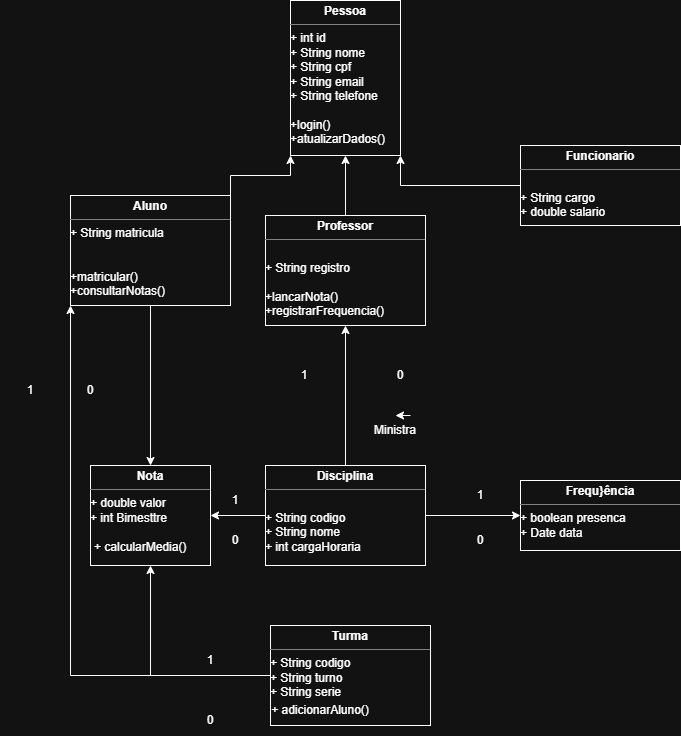
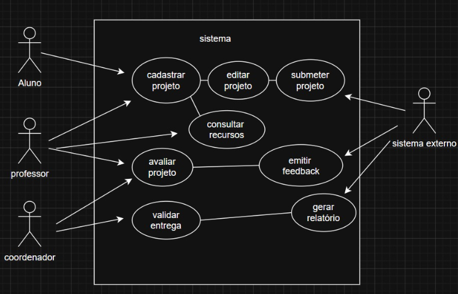
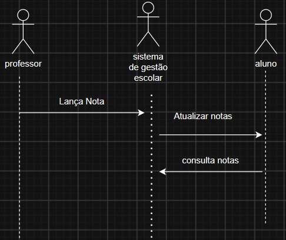

# Sistema de gerenciamento escolar

## 1. Nome do sistema.

Sistema de Gestão Escolar

## 2. Descrição do Problema.

O sistema facilita o controle academico e fncanceiro de um curso técnico, permitindo gereniar professores, semestres, disciplina, cronogramas de aulas e pagamentos, tirando um pouco do processo manual e facilitando a administração

## 3. Objetivo do sistema.

Desenvolver uma aplicação web para auxiliar a coordenação do curso no gerenciamento das disciplinas, cronogramas, alunos e professores.

## 4. Publico alvo

- Cordenador do curso
- Adiministrador do sistema

## 5. Tipo de sistema de Informção

SIG (Sitema de inromação gerencial)

## 6. Técnicas de levantamento

- Entrevista com o cliente
- Questionário
- Observação dos processos administrativos
- Análise das tegras de negócio

## 7. Requisitos Funcionais (RF)

- RF-01: Realizar login por e-mail e senha.
- RF-02: Cadastrar usuarios
- RF-03: Cadastrar professores
- RF-04: Cadastrar semestre
- RF-05: Cadastrar disciplinas vinculadas a um semestre
- RF-06: Cadastrar feriados locais
- RF-07: Gerar automaticamente o cronograma das disciplinas.
- RF-08: PErmitir redefinição de senha
- RF-09: Calcular automaticamente a data final da disciplina
- RF-10: Calcular automaticamente o pagamento do professor
- RF-11: Impedir conflito de horarios entre professores, disciplinas e cronogramas
- RF-12: Permitir editare excluir professores, disciplinas do mesmo professor
- RF-13: Emitir relatorio de disciplinas
- RF-14: Emitir relatorio de pagamento dos professores,
- RF-15: Exportar relatorios para o Excel.

## 8. Requisitos Não Funcionais (RNF)

- RNF-01:
- RNF-02:
- RNF-03:
- RNF-04:
- RNF-05:
- RNF-06:

## 9. Regras de négocio.

- RN-01: O pagamento do professor será calculado por:

  **Valor Total = Total de Horas × Valor da Hora-Aula**

- RN-02: A carga horária financeira é diferente da carga horária utilizada no cronograma
- RN-03: Toda disciplina deve pertencer a um semestre.
- RN-04: O cronograma deve ignorar feriados nacionais e municipais
- RN-05: O sistema deve calcular automaticamente a data final da disciplina
- RN-06: Um professor não pode possuir duas disciplinas no mesmo dia e turno
- RN-07: Na sexta-feira, a primeira aula do turno da noite será transferida para a segunda-feira seguinte
- RN-08: Turmas da tarde seguem alternância semanal entre turmas pares e ímpares
- RN-09: O sistema deve considerar feriados móveis calculados pela data da Páscoa

## 10. Escopo, Premissas e Restrições

### Escopo

- Cadastro de usuários.
- Cadastro de professores.
- Cadastro de semestres.
- Cadastro de disciplinas.
- Cadastro de feriados.
- Geração automática de cronogramas.
- Controle financeiro dos professores.
- Emissão de relatórios.

### Premissas

- O usuário possui login válido.
- Todos os professores possuem os dados bancários cadastrados.
- Os semestres devem ser cadastrados antes das disciplinas.

### Restrições

- Existe apenas um perfil administrativo.
- O sistema funciona em ambiente web.
- Não haverá múltiplos níveis de acesso.

## 11. Matriz de Rastreabilidade

| Requisito | Origem |
|-----------|--------|
| RF-01 | P10 |
| RF-03 | P2 |
| RF-04 | P13 |
| RF-05 | P2 e P14 |
| RF-07 | P5 |
| RF-09 | P3 |
| RF-10 | P8 |
| RF-11 | P17 |
| RF-12 | P9 |
| RF-13 | P18 |
| RF-14 | P9 |

---

## ✅ 12. Diagrama de Casos de Uso *(Concluido)*

---

## ✅ 13. Diagrama de Classes *(Concluido)*

---

## ✅ 14. Diagrama de Sequência *(Concluido)*

---

## ✅ 15. Apresentação Final *(Em construção)*

